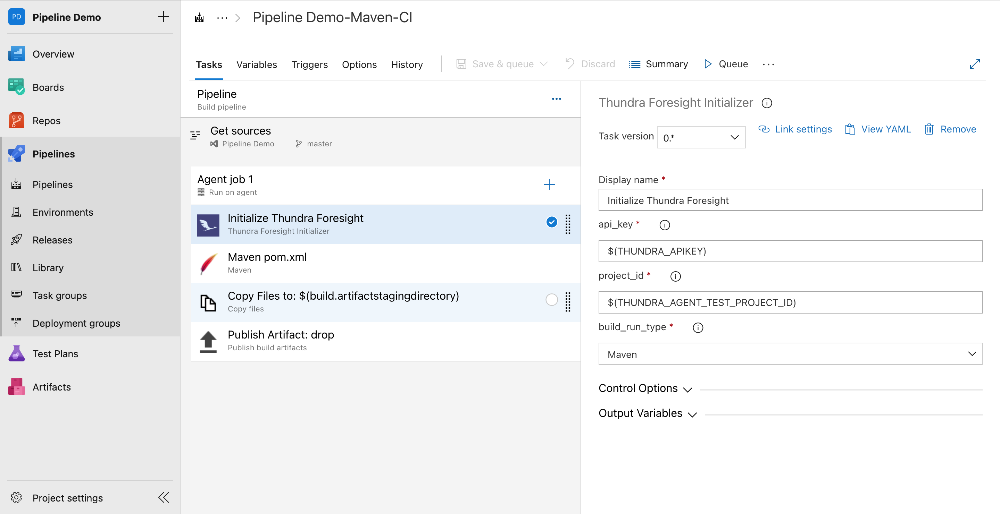
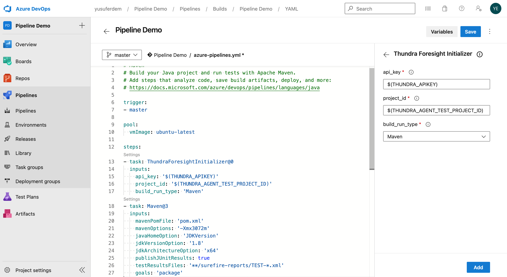

# Thundra Foresight Initializer Task

**Thundra Foresight is a tool for debugging and troubleshooting test failures in no time and optimize build duration and performance in your CI pipeline.**

You can empower your Azure Devops pipeline with Distributed Tracing and  Time-Travel Debugging.

Thundra Foresight Initializer Task automatically changes your build configurations to integrate with Thundra Foresight.

You can integrate your Azure Devops Project pipeline in just 2 steps. First, you need to install the task to your azure devops organization from Visual Studio Marketplace. Then, configure your Azure Devops Project Pipeline yaml. After completing those steps, Foresight will capture your test runs automatically.

**Prerequisites for Task**

1. [**Thundra Account**](https://start.thundra.io/) to record and manage all the process
2. [**Foresight project**](https://foresight.docs.thundra.io/core-concepts/creating-a-project/core-concepts/creating-a-project) to gather parameters
3. `Thundra Foresight Apikey` to connect your pipeline with the Thundra Java agent. It can be obtained from the [**project settings page**](https://foresight.docs.thundra.io/core-concepts/managing-your-project-settings).
4. `Thundra Foresight Project Id` to connect your test runs with the Foresight project. It can be obtained from the [**project settings page**.](https://foresight.docs.thundra.io/core-concepts/managing-your-project-settings)

**Adding task to your pipeline**

- First of all install Thundra Foresight Initializer extension to your azure devops organization.
- Select project that you want to integrate Foresight and Edit your pipeline yaml file or editor.
- If you use  the classic editor to create a pipeline without YAML, Search Thundra Foresight Initializer task from task list (shown below), Add this task to pipeline, **after checkout step and before maven or gradle build/test/verify step**
  

- If you want to use pipeline with yaml, Add this code snippet to your yaml, **between checkout and  maven or gradle test step**
  

      - task: ThundraForesightInitializer@0
        inputs:
          api_key: '$(THUNDRA_APIKEY)'
          project_id: '$(THUNDRA_AGENT_TEST_PROJECT_ID)'
          build_run_type: **Select from list**
- Go to your Pipeline **Variables** page and add the `THUNDRA_APIKEY` (don't forget to keep this value as secret) and `THUNDRA_AGENT_TEST_PROJECT_ID` variables wtih your foresight project configuration described before.

   For further information please visit: [https://foresight.docs.thundra.io/integrations/bitbucket](https://foresight.docs.thundra.io/integrations/bitbucket)